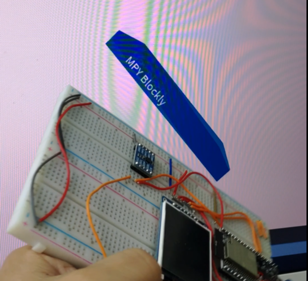
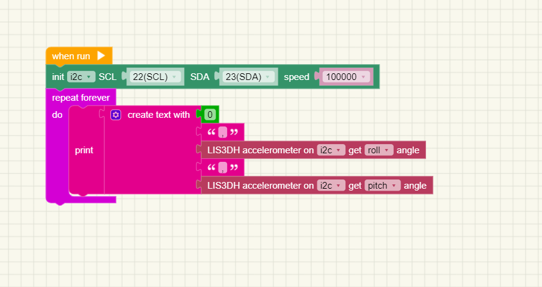

# Accelerometer LIS3DH
This program obtains the pitch and roll angles from the LIS3DH accelerometer.
Then transfer the pitch and roll data to the 'Processing' program on the computer via the serial port.
The Processing program will draw a cube, keeping the attitude of the cube consistent with the LIS3DH accelerometer

## How to use
   
1. Open the 'accelerometer_lis3dh.xml' with [MPY Blockly](https://mpyblockly.github.io/mpyblockly/) , change the wifi username and passwd,then upload the program, run and output data to serial port.
2. Open 'accelerometer_lis3dh.pde' with [Porcessing](https://processing.org/) on you computer, change the 'COM7' with you port in line 'myPort = new Serial(this, "COM7", 115200);'
3. Run 'accelerometer_lis3dh.pde', and roll LIS3DH, you will see the cube roll with LIS3DH.

## Pictures
### My works

### Screenshot

   