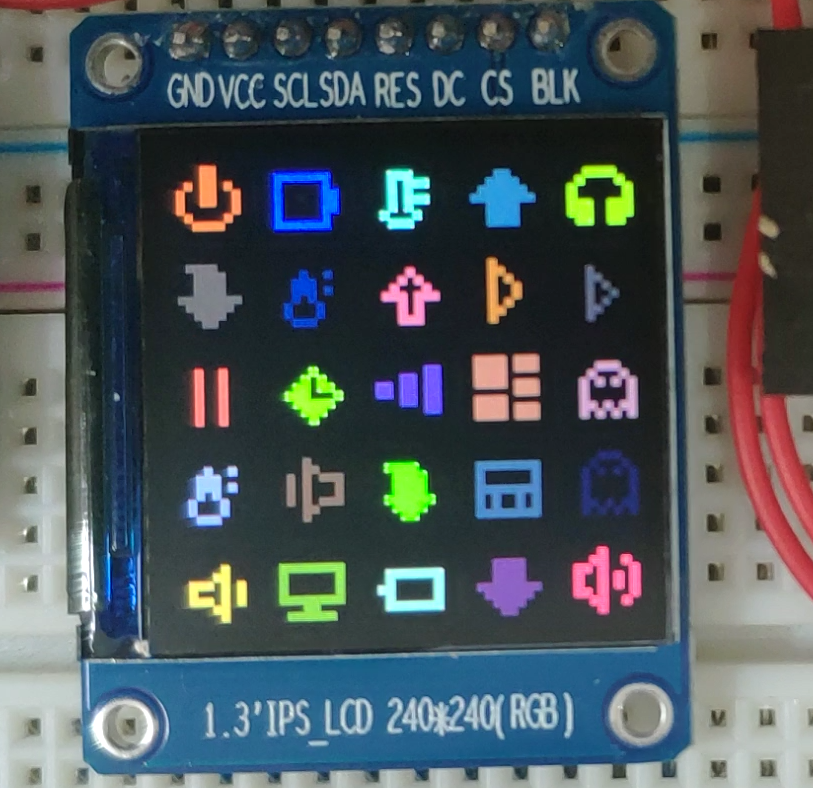
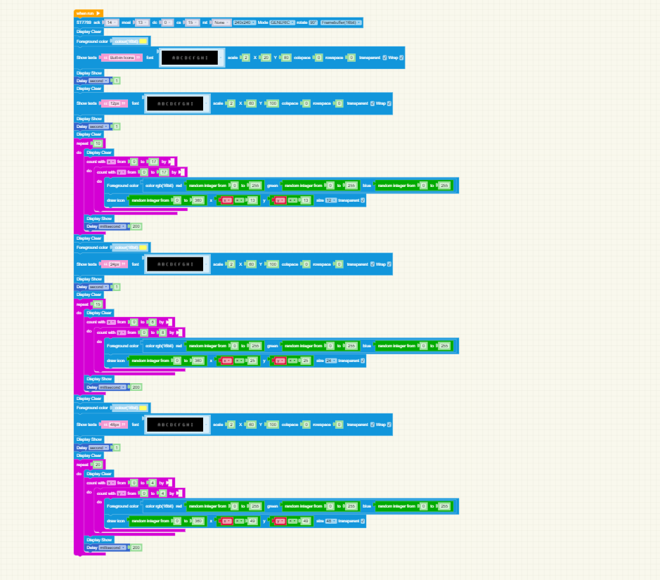

# Wifi Weather Station
MPY Blockly firmware has 360 built-in bitmap icons that supports scale and custom color.
This example show these icons in 12px, 24px and 48px.

## How to use

1. Open the 'bitmap_icons_st7789_240x240.xml' or 'bitmap_icons_st7735_128x160.xml', it's depend which led you use, with [MPY Blockly](https://mpyblockly.github.io/mpyblockly/) .
2. You can use other tft lcds, but you should change the code.

## Pictures

   