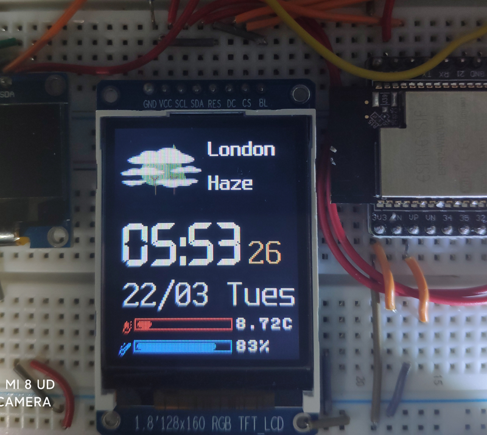

# Wifi Weather Station
This program get the weather infomation from [openweathermap](https://openweathermap.org/), and display the info on a st7735 128x160 TFT LCD.

## How to use
1. download the 'resources' directory and upload the directory to you esp32 micropython board. This directory contains the picture for weather.
2. Open the 'wifi_weather_station.xml' with [MPY Blockly](https://mpyblockly.github.io/mpyblockly/) , change the wifi username and passwd,then upload the program.
3. Wait the board restart and connect to wifi and get the weather infomations.

## Videos

## Pictures
### My works

### Screenshot

   