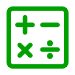
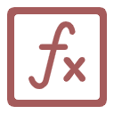
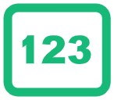
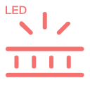
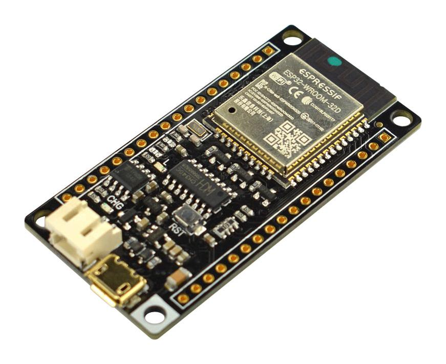

# What is MPY Blockly?
MPY Blockly is a free visual  programming tools for Micropython on ESP32.By stacking coloured blocks on top of each other a control program can be rapidly generated. 

This simple click’n’drag programming method allows you to rapidly develop control sequences for real life microcontroller projects. This programming method is very similar to Scratch 3.

MPY Blockly also supports standard  'text' programming for those who prefer to use a text editor for programming. 

#### *MicroPython*
*MicroPython is a lean and efficient implementation of the Python 3 programming language that includes a small subset of the Python standard library and is optimised to run on microcontrollers and in constrained environments.*

#### *ESP32*
*A feature-rich MCU with integrated Wi-Fi and Bluetooth connectivity for a wide-range of applications*

# Why MPY Blockly?
- For beginners, use MPY Blockly to get started quickly. Even without any programming or hardware foundation. Kids and teens can also start learning programming with MPY Blockly.
- For programmers who are inexperienced in hardware, MPY Blockly can quickly drive a series of common hardware modules such as microcontrollers, various sensors, various motors, buttons, audio equipment, monochrome and color displays, RGB  strips, etc.
- Even for professionals, MPY Blockly integrates various hardware drivers (all tested in detail) and various Internet communication protocols, which can greatly reduce the development workload.

----
# Key features

<strong>Simple to use</strong>

<strong>External Components</strong>

By simply dragging and dropping modules, even a beginner can quickly create works such as "Weather Station" without writing a single line of code.

Supports many external Components, Including hundreds of  sensors, motors, audio and display devices.

&nbsp;

&nbsp;

<strong>Many protocols</strong>

<strong>Additional features</strong>

Built-in support for many communication protocols such as Wifi, Bluetooth, serial port, etc.  Built-in support for IoT protocols such as MQTT and Blynk  Built-in support for network time synchronization, weather services and other Internet protocols.

Built-in code editor.  Built-in serial monitor. Auto save Automatically detect serial ports

----

<!-- ## Blocks catagory

- MicroPython

| Control                                   | Text                                   | Math                                   | Variables                             | Functions                             | List                                   | Tuple                                   | Dict                                   | Set                                   | Storage                                  |
| ----------------------------------------- | -------------------------------------- | -------------------------------------- | ------------------------------------- | ------------------------------------- | -------------------------------------- | --------------------------------------- | -------------------------------------- | ------------------------------------- | ---------------------------------------- |
|  |  |  |  |  |  |  |  |  |  |

- **ESP32** System|Bus|Bluetooth|UART
- **External Components** TFT&MONO|Segment LED|LCD|LED Matrix|Neopixel|Sensors|Actuator|Buzzer|Audio,
- **Network**Network|IoT -->

## Features Datail

<table>
    <tr class='tableHead'>
      <td width="10%">Category</td>
      <td width="10%">Icon</td>
      <td width="80%">Description</td>
    </tr>
    <tr>
		  <td class='category'>MCU</td>
      <td></td>
      <td>ESP32 Chip functions, such as Pins and GPIO, ,Touch Keys, Timer, general borad control.</td>
    </tr>
    <tr>
		  <td class='category'>Control</td>
      <td></td>
      <td>Python If...Else, Loop and Logic.</td>
    </tr>
    <tr>
		  <td class='category'>Text</td>
      <td></td>
      <td>Python Common string operations</td>
    </tr>
    <tr>
		  <td class='category'>Math</td>
      <td></td>
      <td>Python Mathematical functions</td>
    </tr>
    <tr>
		  <td class='category'>Variables</td>
      <td></td>
      <td>Python Variable</td>
    </tr>
    <tr>
		  <td class='category'>Functions</td>
      <td></td>
      <td>Python Functions</td>
    </tr>
    <tr>
		  <td class='category'>Network</td>
      <td></td>
      <td>ESP32 Wifi, Client, AP, Radio(ESP NOW), HTTP Client and Socket</td>
    </tr>
    <tr>
		  <td class='category'>Storage</td>
      <td></td>
      <td>Btree database, File operator and SD Card.</td>
    </tr>
    <tr>
		  <td class='category'>List</td>
      <td></td>
      <td>Python Data Structre List</td>
    </tr>
    <tr>
		  <td class='category'>Tuple</td>
      <td></td>
      <td>Python Data Structre Tuple</td>
    </tr>
    <tr>
		  <td class='category'>Set</td>
      <td></td>
      <td>Python Data Structre Set</td>
    </tr>
    <tr>
		  <td class='category'>TFT&Mono</td>
      <td></td>
      <td>Draw functions(rect,circle,text,image...), UI functions, TFT Drivers(ST7789, ST7735, ILI9431, SSD1351, SSD1331) and Monechrome Drivers(SSD1306, SSD1106, ST7302, PCD8455).</td>
    </tr>
    <tr>
		  <td class='category'>7SegLed</td>
      <td></td>
      <td>TM1367 4-digit 7-segment LED display</td>
    </tr>
    <tr>
		  <td class='category'>LCD</td>
      <td></td>
      <td>LCD I2C ( LCD1602/1604/2004)</td>
    </tr>
    <tr>
		  <td class='category'>LED Matrix</td>
      <td></td>
      <td>MAX7219 LED Matrix</td>
    </tr>
    <tr>
		  <td class='category'>Neopixel</td>
      <td></td>
      <td>Neopixel RGB LEDs</td>
    </tr>
    <tr>
		  <td class='category'>Sensors</td>
      <td></td>
      <td>Sensors include Temperature, Distance, Accelerometer, Motion Inertial, Compass, Colour, Proximity and Biometric.</td>
    </tr>
    <tr>
		  <td class='category'>Actuator</td>
      <td></td>
      <td>Actuator Modules include Button, IR Remote, Rotary, Motor, Servo, Stepper, RTC, DAC, RFID and others.</td>
    </tr>
    <tr>
		  <td class='category'>Buzzer</td>
      <td></td>
      <td>Music from buzzer</td>
    </tr>
    <tr>
		  <td class='category'>Audio</td>
      <td></td>
      <td>Audio with I2S, Play MP3 or Wav, Record, TTS and Audio indentify.</td>
    </tr>
      <tr>
		  <td class='category'>Bus</td>
      <td></td>
      <td>ESP32 I2C and SPI Bus</td>
    </tr>
		  <tr>
		  <td class='category'>Bluetooth</td>
      <td></td>
      <td>ESP32 Bluetooth includes Perpheral, Centeral, BLE HID and BLU UART.</td>
    </tr>
		  <tr>
		  <td class='category'>UART</td>
      <td></td>
      <td>ESP32 UART.</td>
    </tr>
	    <tr>
		  <td class='category'>IoT</td>
      <td></td>
      <td>IoT functions include MQTT, Blynk and OMA Weather services.</td>
    </tr>
</table>

## Built-in supported Hardwares

<h3 id="mcu">MCU</h3>

<table>
    <tr class='tableHead'>
      <td>ESP32 devkitC 32d</td>
      <td>ESP32 devkitC 32u</td>
      <td>ESP32 devkitC Wrover</td>
      <td>ESP32 goouuuu</td>
      <td>ESP32 mini borad</td>
      <td>ESP32 nodemcu 32s</td>
		  <td>ESP32 t8 psram</td>
    </tr>
		<tr>
      <td width="14.3%"></td>
      <td width="14.3%"></td>
      <td width="14.3%"></td>
      <td width="14.3%"></td>
      <td width="14.3%"></td>
      <td width="14.3%"></td>
		  <td width="14.3%"></td>
    </tr>
    <tr class='tableHead'>
      <td>ESP32 uno d1r32</td>
			<td>FireBeetle ESP32</td>
			<td></td>
			<td></td>
			<td></td>			
			<td></td>
			<td></td>
    </tr>
		<tr>
      <td width="14.3%"></td>
			<td width="14.3%"></td>
			<td></td>
			<td></td>
			<td></td>
			<td></td>
			<td></td>
		</tr>
</table>

<h3 id="display---tft">Display - TFT</h3>

<table>
    <tr class='tableHead'>
      <td width="14.3%">ST7735 128x160 blue</td>
      <td width="14.3%">ST7735 128x160 red</td>
      <td width="14.3%">ST7735 128x128 red</td>
      <td width="14.3%">ST7735 80x160 blue</td>
      <td width="14.3%">ST7789 240x240</td>
      <td width="14.3%">ST7789 135x240</td>
      <td width="14.3%">SSD1351 128x128</td>
   </tr>
    <tr>
      <td></td>
      <td></td>
      <td></td>
      <td></td>
      <td></td>
      <td></td>
      <td></td>
    </tr>
</table>
<table>
    <tr class='tableHead'>
      <td width="14.3%">SSD1351 128x96</td>
      <td width="14.3%">SSD1331 96x64</td>
      <td width="14.3%">ILI9341 240x320 red</td>
      <td width="14.3%">ILI9341 240x320 blue</td>
      <td width="14.3%">                 </td>
      <td width="14.3%">                 </td>
      <td width="14.3%">                 </td>
    </tr>
    <tr>
      <td></td>
      <td></td>
      <td></td>
      <td></td>
      <td> </td>
      <td width="14.3%">                 </td>
      <td width="14.3%">                 </td>
    </tr>
</table>

<h3 id="display---monochrome">Display - Monochrome</h3>

<table>
    <tr class='tableHead'>
      <td width="14.3%">ssd1306 128x64</td>
      <td width="14.3%">ssd1306 128x32</td>
      <td width="14.3%">ssd1306 72x40</td>
      <td width="14.3%">ssd1106 128x64</td>
      <td width="14.3%">ssd1106 64x32</td>
      <td width="14.3%">st7302 122x250</td>
      <td width="14.3%">nokia5110 84x48</td>
    </tr>
    <tr>
      <td></td>
      <td></td>
      <td></td>
      <td></td>
      <td></td>
      <td></td>
      <td></td>
    </tr>
</table>

<h3 id="display---others">Display - Others</h3>
<table>
    <tr class='tableHead'>
      <td width="14.3%">LCD 16x2</td>
      <td width="14.3%">LCD 20x4</td>
      <td width="14.3%">TM1367 segment led</td>
      <td width="14.3%">MAX7219 led matrix</td>
      <td width="14.3%">WS2812 led matrix</td>
      <td width="14.3%">WS2812 led ring</td>
      <td width="14.3%">WS2812 led strip</td>
    </tr>
    <tr>
      <td></td>
      <td></td>
      <td></td>
      <td></td>
      <td></td>
      <td></td>
      <td></td>
    </tr>
</table>

<h3 id="sensors---temperature">Sensors - Temperature</h3>
<table>
    <tr class='tableHead'>
      <td width="14.3%">DHT11 Temp Humi</td>
      <td width="14.3%">DHT22 Temp Humi</td>
      <td width="14.3%">BMP280 Temp Humi Pressure</td>
      <td width="14.3%">BMP180 Temp Humi Pressuree</td>
      <td width="14.3%">SHT3x High Accuracy Temp Humi</td>
      <td width="14.3%">DS18B20 Temp</td>
      <td width="14.3%">MLX90614  Infrared Thermometer</td>
    </tr>
    <tr>
      <td></td>
      <td></td>
      <td></td>
      <td></td>
      <td></td>
      <td></td>
      <td></td>
    </tr>
</table>

<h3 id="sensors---distanceacceleromtermotion">Sensors - Distance&amp;Acceleromter&amp;Motion</h3>
<table>
    <tr class='tableHead'>
      <td width="14.3%">HC-SR04 Ultrasonic Distance</td>
      <td width="14.3%">VL53l0 ToF ranging</td>
      <td width="14.3%">VL53l1 ToF ranging</td>
      <td width="14.3%">LIS3DH 3-Axis Motion</td>
      <td width="14.3%">MPU6050 6-Axis Motion</td>
      <td width="14.3%">MPU9250  9-Axis Motion</td>
      <td width="14.3%">                 </td>
    </tr>
    <tr>
      <td></td>
      <td></td>
      <td></td>
      <td></td>
      <td></td>
      <td></td>
      <td width="14.3%">                 </td>
    </tr>
</table>

<h3 id="sensors---others">Sensors - Others</h3>
<table>
    <tr class='tableHead'>
      <td width="14.3%">APDS9930 Light Proximity</td>
      <td width="14.3%">MAX30102 Oximeter Heart-Rate</td>
      <td width="14.3%">TCS3472 Color</td>
      <td width="14.3%">HMC5883l 3-Axis  Compass</td>
      <td width="14.3%">QMC5883 3-Axis Magnetic</td>
      <td width="14.3%">                 </td>
      <td width="14.3%">                 </td>
    </tr>
    <tr>
      <td></td>
      <td></td>
      <td></td>
      <td></td>
      <td></td>
      <td width="14.3%">                 </td>
      <td width="14.3%">                 </td>
    </tr>
</table>

<h3 id="input---button-touch-button-joystick">Input - Button, Touch button, Joystick</h3>
<table>
    <tr class='tableHead'>
      <td width="14.3%">Button</td>
      <td width="14.3%">Five buttons</td>
      <td width="14.3%">Joystick model 1</td>
      <td width="14.3%">Joystick model 2</td>
      <td width="14.3%">Touch button 1</td>
      <td width="14.3%">Touch button 4</td>
      <td width="14.3%">IR Remote</td>
    </tr>
    <tr>
      <td></td>
      <td></td>
      <td></td>
      <td></td>
      <td></td>
      <td></td>
      <td></td>
    </tr>
</table>
<h3 id="motor-servo-and-stepper">Motor, Servo and Stepper</h3>
<table>
    <tr class='tableHead'>
      <td width="14.3%">L298N Motor Drive Controller</td>
      <td width="14.3%">L9110S Motor Drive Controller</td>
      <td width="14.3%">L9110S-4 Motor Drive Controller</td>
      <td width="14.3%">Stepper ULN2003 Driver</td>
      <td width="14.3%">SG90 Servo 180</td>
      <td width="14.3%">SG90 Servo 360</td>
      <td width="14.3%">MG90 Servo 180/360</td>
    </tr>
    <tr>
      <td></td>
      <td></td>
      <td></td>
      <td></td>
      <td></td>
      <td></td>
      <td></td>
    </tr>
</table>
<h3 id="rtc-dac-rfid-and-relay">RTC, DAC, RFID and Relay</h3>
<table>
    <tr class='tableHead'>
      <td width="14.3%">RTC DS3231</td>
      <td width="14.3%">RTC DS1307</td>
      <td width="14.3%">RTC DS1302</td>
      <td width="14.3%">DAC MCP4725</td>
      <td width="14.3%">RFID MFRC522</td>
      <td width="14.3%">Relay 1-channel</td>
      <td width="14.3%">Relay 2-channel</td>
    </tr>
    <tr>
      <td></td>
      <td></td>
      <td></td>
      <td></td>
      <td></td>
      <td></td>
      <td></td>
    </tr>
</table>

<h3 id="common-sensors">Common Sensors</h3>
<table>
    <tr class='tableHead'>
      <td width="14.3%">IR detector</td>
      <td width="14.3%">Photorezistor</td>
      <td width="14.3%">Optical barrier</td>
      <td width="14.3%">Microphone</td>
      <td width="14.3%">RCWL-0516</td>
      <td width="14.3%">PIR SB00422A-1</td>
      <td width="14.3%">PIR HC-SR505</td>
    </tr>
    <tr>
      <td></td>
      <td></td>
      <td></td>
      <td></td>
      <td></td>
      <td></td>
      <td></td>
    </tr>
</table>
<table>
    <tr class='tableHead'>
      <td width="14.3%">PIR 312</td>
      <td width="14.3%">Infrared flame</td>
      <td width="14.3%">Hall probe</td>
      <td width="14.3%">Current sensor</td>
      <td width="14.3%">TCRT5000 IRtracing</td>
      <td width="14.3%">SW-1801P shock</td>
      <td width="14.3%">Light sensor</td>
    </tr>
    <tr>
      <td></td>
      <td></td>
      <td></td>
      <td></td>
      <td></td>
      <td></td>
      <td></td>
    </tr>
</table>
